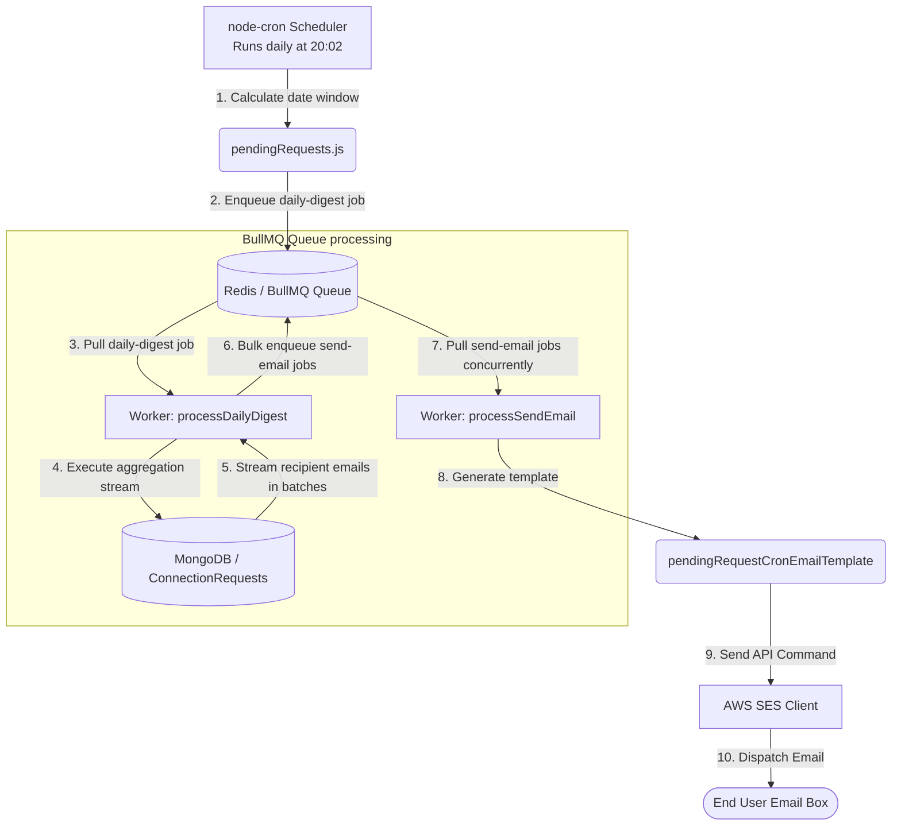

# DevTinder: Pending Connection Requests Notification System

This documentation provides a comprehensive, educational deep dive into how DevTinder schedules, processes, and sends daily digest emails to users who have pending connection requests.

---

## 1. System Architecture Overview

The system is designed to be **asynchronous, resilient, and scalable**. Rather than running a blocking, memory-intensive database query that sends emails synchronously (which would block the event loop and crash under high load), the architecture decouples task scheduling, database querying, and email dispatching.



---

## 2. Component-by-Component Walkthrough

### A. The Scheduler (`pendingRequests.js`)
* **File Reference:** [pendingRequests.js](file:///home/spectrax07/Projects/Learning/devTinder/src/jobs/pendingRequests.js)

```javascript
cron.schedule('02 20 * * *', async () => { ... })
```

* **Purpose:** Acts as the entry point of the daily notification pipeline.
* **Mechanism:**
  1. It uses `node-cron` to execute every day at **20:02 (8:02 PM)**.
  2. It calculates the time window of the previous day ("yesterday") from `00:00:00.000` to `23:59:59.999` using `date-fns` functions (`subDays`, `startOfDay`, `endOfDay`).
  3. It calls `scheduleDailyPendingRequestDigest(yesterdayDayStart, yesterdayDayEnd)` to queue the main coordinator job.
  4. It does not perform any database queries or email sending directly; it offloads all work to the message queue.

---

### B. The Producer (`producer.js`)
* **File Reference:** [producer.js](file:///home/spectrax07/Projects/Learning/devTinder/src/queues/pending-request-email/producer.js)

The producer handles pushing jobs onto the Redis-backed BullMQ queue.

#### 1. Scheduling the Digest Coordinator
```javascript
export const scheduleDailyPendingRequestDigest = async (startDate, endDate) => {
  const windowKey = startDate.toISOString();
  await pendingRequestEmailQueue.add(
    JOB_NAMES.DAILY_DIGEST,
    { startDate: startDate.toISOString(), endDate: endDate.toISOString() },
    {
      jobId: `daily-digest:${windowKey}`, // Deduplication
      removeOnComplete: true,
    },
  );
};
```
* **Deduplication Strategy:** By explicitly setting the `jobId` to `daily-digest:${windowKey}`, we leverage Redis key unique constraints. If the cron scheduler fires twice, or multiple application instances try to queue the job for the same day, BullMQ will ignore the duplicate request, ensuring we only generate one digest run per time window.

#### 2. Enqueuing Individual Emails
```javascript
export const enqueuePendingRequestEmails = async (recipients, windowKey) => {
  if (recipients.length === 0) return;

  const jobs = recipients.map(({ email }) => ({
    name: JOB_NAMES.SEND_EMAIL,
    data: { email, windowKey },
    opts: {
      jobId: `send-email:${windowKey}:${email}`, // Deduplication per user per day
    },
  }));

  await pendingRequestEmailQueue.addBulk(jobs);
};
```
* **Bulk Operation:** `addBulk` enqueues multiple jobs in a single Redis command. This is far more efficient than calling `.add()` in a loop, reducing network overhead.
* **Email Deduplication:** If the system crashes halfway through processing and restarts, the unique `jobId: send-email:${windowKey}:${email}` prevents users from receiving duplicate emails for the same day's digest.

---

### C. The Database Layer (Mongoose & Aggregation Cursors)
* **File References:** 
  - [connectionRequest.repository.js](file:///home/spectrax07/Projects/Learning/devTinder/src/features/request/connectionRequest.repository.js)
  - [connectionRequest.model.js](file:///home/spectrax07/Projects/Learning/devTinder/src/features/request/connectionRequest.model.js)

The system needs to identify all users who received a connection request yesterday. The query must be fast, return unique emails, and handle massive datasets efficiently.

#### The Aggregation Pipeline
```javascript
const pendingRecipientPipeline = (startDate, endDate) => [
  {
    $match: {
      status: 'Interested',
      createdAt: {
        $gte: startDate,
        $lte: endDate,
      },
    },
  },
  {
    $group: {
      _id: '$toUserId', // Unique recipient user IDs
    },
  },
  {
    $lookup: {
      from: 'users',
      localField: '_id',
      foreignField: '_id',
      as: 'user',
    },
  },
  {
    $unwind: '$user',
  },
  {
    $project: {
      _id: 0,
      email: '$user.email',
    },
  },
];
```

| Phase | MongoDB Aggregation Operator | Explanation |
| :--- | :--- | :--- |
| **1. Match** | `$match` | Filters `ConnectionRequest` documents where the status is `'Interested'` and `createdAt` falls inside the calculated 24-hour yesterday window. |
| **2. Group** | `$group` | Groups records by `toUserId`. If user A received 5 connection requests yesterday, this stage squashes them down to a single row containing `_id: A`'s ID. This prevents sending 5 separate digest emails to A. |
| **3. Lookup** | `$lookup` | Performs a database join (SQL `LEFT JOIN` equivalent) with the `users` collection to pull the actual user profile for the recipient. |
| **4. Unwind** | `$unwind` | Deconstructs the joined `user` array (which contains a single matched user document) into a flat object structure. |
| **5. Project** | `$project` | Retains only the `email` field and discards the Mongo `_id`, minimizing database-to-app memory payloads. |

#### Why Cursors & Streams?
```javascript
export const streamPendingRecipientEmails = (startDate, endDate, { batchSize = 500 } = {}) => {
  return ConnectionRequest.aggregate(
    pendingRecipientPipeline(startDate, endDate)
  ).cursor({ batchSize });
};
```
> [!IMPORTANT]
> **Memory Efficiency vs. Heap Blowout**
> 
> Loading all matched rows into application memory using `await ConnectionRequest.find(...)` or `.aggregate(...)` stores the entire result array in V8's heap memory. If you have 500,000 active recipients, this will exceed Node's default memory limits and cause an **Out of Memory (OOM) crash**.
> 
> By using `.cursor({ batchSize })`, Mongoose returns an **async generator stream**. MongoDB fetches documents over the wire in chunks of `batchSize` (default: 500). The application processes them on-the-fly and releases them to the garbage collector, maintaining a flat memory footprint close to zero regardless of collection size.

---

### D. The Worker Layer (`worker.js`)
* **File Reference:** [worker.js](file:///home/spectrax07/Projects/Learning/devTinder/src/queues/pending-request-email/worker.js)

The BullMQ `Worker` is configured to process jobs off of the `pending-request-email` queue. It switches on the job name to execute different subroutines.

#### 1. Processing `daily-digest` (The coordinator)
```javascript
const processDailyDigest = async (job) => {
  const startDate = new Date(job.data.startDate);
  const endDate = new Date(job.data.endDate);
  const windowKey = job.data.startDate;

  // 1. Get database cursor stream
  const cursor = connectionRequestService.streamPendingRecipientEmails(
    startDate,
    endDate,
    { batchSize: pendingRequestQueueConfig.scanCursorBatchSize }, // 500
  );

  let batch = [];
  let enqueued = 0;

  // 2. Iterate over streamed rows
  for await (const row of cursor) {
    const email = row?.email ? String(row.email).trim() : '';
    if (!email) continue;

    batch.push({ email });

    // 3. Batch enqueuing to Redis
    if (batch.length >= pendingRequestQueueConfig.enqueueBatchSize) { // 100
      await enqueuePendingRequestEmails(batch, windowKey);
      enqueued += batch.length;
      batch = [];
    }
  }

  // Enqueue remaining records
  if (batch.length > 0) {
    await enqueuePendingRequestEmails(batch, windowKey);
    enqueued += batch.length;
  }

  return { enqueued };
};
```
* **Streaming loop:** The worker runs a `for await...of` loop over the Mongo aggregation cursor.
* **Batch Enqueuing:** As it reads emails, it accumulates them. Once the array hits `enqueueBatchSize` (configured as 100 in Zod schemas), it enqueues them into BullMQ in bulk. This maintains high throughput and balances Redis I/O.

#### 2. Processing `send-email` (The executor)
```javascript
const processSendEmail = async (job) => {
  const { email } = job.data;
  const emailTemplate = pendingRequestCronEmailTemplate(email);
  const res = await sendEmail(emailTemplate);

  if (!res.success) {
    throw res.error ?? new Error(`SES rejected email to ${email}`);
  }

  return res;
};
```
* **Job Execution:** Pulls the recipient email from the job data, wraps it with `pendingRequestCronEmailTemplate` (which generates the HTML and plain-text contents), and calls `sendEmail`.
* **Error Escalation:** If AWS SES rejects the email or fails (e.g. rate-limiting, network glitch), we throw an error. BullMQ catches this exception, marks the job as `failed`, and queues it for a retry.

---

### E. Configuration & Resiliency Settings
* **File Reference:** [server.schema.js](file:///home/spectrax07/Projects/Learning/devTinder/src/core/server.schema.js)

The system relies on settings verified via `Zod` validation:

```javascript
pendingRequestEmail: Object.freeze({
  enqueueBatchSize: queue.PENDING_REQUEST_ENQUEUE_BATCH_SIZE, // Default: 100
  emailWorkerConcurrency: queue.PENDING_REQUEST_EMAIL_CONCURRENCY, // Default: 10
  scanCursorBatchSize: queue.PENDING_REQUEST_SCAN_BATCH_SIZE, // Default: 500
  defaultJobOptions: Object.freeze({
    removeOnComplete: { count: 1_000 },
    removeOnFail: { count: 5_000 },
    attempts: 3,
    backoff: Object.freeze({ type: 'exponential', delay: 5_000 }),
  }),
})
```

#### Important Resiliency Options:
* **`concurrency: 10`**: The email worker can process **10 email dispatch jobs concurrently**. Instead of waiting for one email request to finish before starting the next, it fires 10 SES network requests in parallel.
* **`attempts: 3`**: If a `send-email` job fails, BullMQ will retry it up to 3 times before marking it permanently failed.
* **`backoff: { type: 'exponential', delay: 5000 }`**: In case of failures (such as hitting AWS SES rate limits), the retries are delayed exponentially.
  - Attempt 1: immediate.
  - Attempt 2: delayed by 5s.
  - Attempt 3: delayed by 10s.
  This "breathing room" prevents compounding network problems or rate limits.
* **`removeOnComplete / removeOnFail`**: Cleans up finished jobs from Redis so memory usage does not grow indefinitely.

---

### F. The Email Transport (`emailService.js`)
* **File Reference:** [emailService.js](file:///home/spectrax07/Projects/Learning/devTinder/src/utils/aws-ses/emailService.js)

* **Protocol:** Uses AWS SDK v3 (`@aws-sdk/client-ses`).
* **Command Pattern:** Constructs a `SendEmailCommand` containing:
  - **Source (From Address)**: `noreply@devtinder.subratajana.com`
  - **Destination**: The recipient `email`.
  - **Message**: The compiled Subject, HTML Body, and Plain-text fallback body.
* **Client Execution:** The command is sent via `sesClient.send(command)`.

---

## 3. Core BullMQ Concepts Explained

BullMQ is a popular message queue library for Node.js built on top of **Redis**. In this application:

1. **Redis as a Message Broker**: Redis holds the queue. It stores lists of job states: `waiting`, `active`, `completed`, `failed`, and `delayed`.
2. **Producers**: Code that inserts jobs into the queue (`Queue.add()` / `Queue.addBulk()`).
3. **Workers**: Independent runners that poll Redis for jobs, execute the associated functions, and report back the results (`new Worker(...)`).
4. **Decoupled Scaling**: In production, you could run **Worker instances** on completely different servers or container clusters than your main Express HTTP web server. Under a high email load, the workers will spin up and process the email backlog without impacting the API response times of users using the web app.
